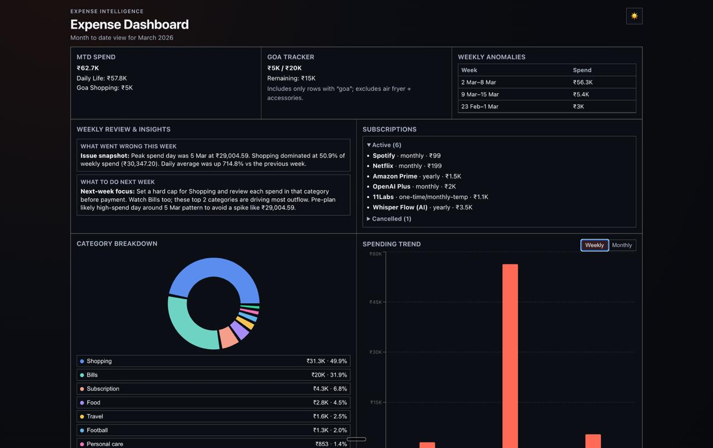

# Expense Dashboard (Local React + Vite)

A local dashboard for Sukrit’s expense tracking files:

- `productivity/expenses.csv`
- `productivity/investments.csv`
- `productivity/subscriptions.csv`

The app uses copied CSVs from `src/data/*.csv` so Vite can load them directly in the browser.

## What this dashboard shows

1. **MTD total card** + split into **Daily Life vs Goa Shopping**
2. **Category breakdown** table + pie chart
3. **Goa tracker** (spent/remaining) with rule: exclude air fryer + accessories
4. **Subscriptions panel** for active and cancelled items
5. **Weekly anomaly list** (top spend days)
6. **Weekly Review & Insights** generated from loaded spend patterns (recent 7-day trend, peak day, dominant categories)
7. **Light/Dark theme toggle** with Mac-like typography and polished card/charts styling

## Setup (local)

```bash
cd /root/.openclaw/workspace/expense-dashboard
npm install
npm run refresh-data
npm run dev
```

Then open the local Vite URL shown in terminal (usually `http://localhost:5173`).

## Vercel Private Deploy

Minimal steps for Sukrit:

1. Push this `expense-dashboard` folder to GitHub.
2. In Vercel, import the repo/project.
3. In **Project Settings → Environment Variables**, set:
   - `BASIC_AUTH_USER`
   - `BASIC_AUTH_PASS`
4. Deploy.
5. Open the deployment URL. Browser should prompt for username/password before loading the dashboard.

### Security note

- This deploy uses **server-side Basic Auth in Vercel middleware** (`middleware.js`).
- A front-end auth modal is **not used** and is not considered secure for this requirement.

### Data freshness in hosted mode

#### Immediate (implemented now)

- The UI reads CSVs from `src/data/*.csv`, so data is bundled at build time.
- To refresh hosted data:
  1. Update source CSVs in `productivity/*.csv`
  2. Run `npm run refresh-data`
  3. Commit/push changes
  4. Trigger Vercel redeploy (auto on push or manual redeploy)

#### Optional next (implemented endpoint, not wired to UI yet)

- `GET /api/csv-runtime` reads current `src/data/*.csv` files at request time from a serverless function.
- This gives a practical path to runtime data reads in a future UI iteration without changing current dashboard behavior today.

### Exact verification steps

1. **Auth challenge check**
   - Open deployed URL in an incognito/private window.
   - Expected: browser auth prompt appears before any dashboard HTML renders.
2. **Wrong credentials check**
   - Enter wrong credentials.
   - Expected: access denied / repeated prompt; dashboard not visible.
3. **Correct credentials check**
   - Enter `BASIC_AUTH_USER` / `BASIC_AUTH_PASS` values.
   - Expected: dashboard loads normally (UI unchanged).
4. **Runtime endpoint check (optional next path)**
   - Visit `/api/csv-runtime` after authenticating.
   - Expected: JSON response with `source: "runtime-csv"` and `data` payload.
5. **Freshness check for build-time path**
   - Change a CSV value, run `npm run refresh-data`, push, redeploy.
   - Expected: updated value appears in dashboard after deploy.

## Refreshing data from source CSVs

Whenever `productivity/*.csv` changes, re-copy fresh data:

```bash
cd /root/.openclaw/workspace/expense-dashboard
npm run refresh-data
```

This script copies from:

- `../expenses.csv`
- `../investments.csv`
- `../subscriptions.csv`

to:

- `src/data/expenses.csv`
- `src/data/investments.csv`
- `src/data/subscriptions.csv`

## Preview



## Credits

Built iteratively by **Mac** (AI assistant) for Sukrit’s workflow.

## Notes

- Goa tracker includes entries where item/notes contain `goa` and excludes `air fryer`, `airfryer`, and `accessories`.
- All amounts are displayed in INR formatting.
- Theme toggle includes a clean airy light mode and a near-black high-contrast dark mode with subtle warm accent glow for hierarchy.
